在iOS中Delegate使用单例模式保证只有一份对象，使用享元模式，降低了对象的读写次数，提高了性能，使用`NSString、NSArray、NSMutableArray`等使用了创建型的抽象工厂模式，保留了内部创建步骤，产出多个类型产品，`AppDelegate`使用状态模式来改变APP的状态，`UIView`使用外观模式封装了一系列接口使view显示出来，`tableview`使用代理模式实现了`view`和数据的分离。其实还有很多我们在用而不是很清楚的设计模式，那么我们就来看下常用的设计模式。


### 设计模式
> 设计模式（Design Pattern）是一套被反复使用、多数人知晓的、经过分类的、代码设计经验的总结。
使用设计模式的目的：为了代码可重用性、让代码更容易被他人理解、保证代码可靠性。 设计模式使代码编写真正工程化；设计模式是软件工程的基石脉络，如同大厦的结构一样。

设计模式分为创建型、结构型模式、行为型模式，通过[借来](https://www.runoob.com/design-pattern/design-pattern-intro.html)一张图来表示一下

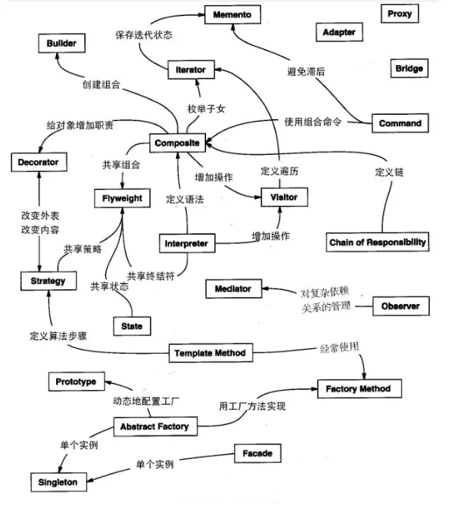

### 创建型模式
这些设计模式提供了一种在创建对象的同时隐藏创建逻辑的方式，而不是使用 new 运算符直接实例化对象。这使得程序在判断针对某个给定实例需要创建哪些对象时更加灵活。
#### 1.简单工厂模式
简单工厂模式(Simple Factory Pattern)：又称为静态工厂方法(Static Factory Method)模式，它属于类创建型模式。在简单工厂模式中，可以根据参数的不同返回不同类的实例。简单工厂模式专门定义一个类来负责创建其他类的实例，被创建的实例通常都具有共同的父类。


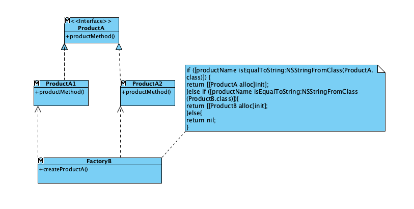

在工厂模式中，我们在创建对象时不会对客户端暴露创建逻辑，并且是通过使用一个共同的接口来指向新创建的对象。
```
Sample sample=new Sample(参数);
```
在OC中我们通常这样子用
```
// productMethod 产品的方法
@protocol Product <NSObject>
-(void)productMethod;
@end


//工厂类
@interface SimpleFactory : NSObject
+(id<Product>)createProduct:(NSString *)productName;
@end

//产品A 实现协议代替 抽象方法
@interface ProductA : NSObject<Product>
@end
//产品B 实现协议代替 抽象方法
@interface ProductB : NSObject<Product>
@end

@class ProductA,ProductB;

@implementation SimpleFactory

+ (id<Product>)createProduct:(NSString *)productName{
    if ([productName isEqualToString:NSStringFromClass(ProductA.class)]) {
        return [[ProductA alloc]init];
    }else if ([productName isEqualToString:NSStringFromClass(ProductB.class)]){
        return [[ProductB alloc]init];
    }else{
        return nil;
    }
}
@end
@implementation ProductA
- (void)productMethod {
    
}
@end
@implementation ProductB
- (void)productMethod {
}
@end
```
使用的时候是这样子
```
//创建产品A
ProductA *a =[SimpleFactory createProduct:NSStringFromClass(ProductA.class)];
[a productMethod];
//创建产品B
ProductB *b =[SimpleFactory createProduct:NSStringFromClass(ProductB.class)];
[b productMethod];
```
优点是通过一个参数确定想要的哪个类的实例，而不用关心内部如何实现，缺点是新增加一个产品需要更改`createProduct:(NSString *)productName`的实现。

#### 2.工厂模式

工厂方法模式(Factory Method Pattern)又称为工厂模式，也叫虚拟构造器(Virtual Constructor)模式或者多态工厂(Polymorphic Factory)模式，它属于类创建型模式。在工厂方法模式中，工厂父类负责定义创建产品对象的公共接口，而工厂子类则负责生成具体的产品对象，这样做的目的是将产品类的实例化操作延迟到工厂子类中完成，即通过工厂子类来确定究竟应该实例化哪一个具体产品类。

工厂方法模式包含如下角色：

- Product：抽象产品
- ProductA：具体产品
- Factory：抽象工厂
- FactoryA：具体工厂

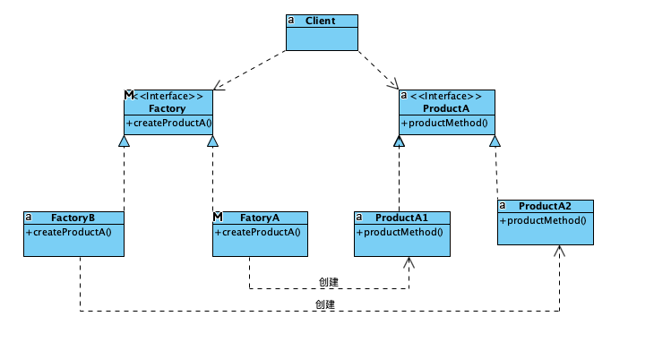

相比于简单工厂模式，只需要将工厂抽象出来，在OC中可以使用协议分离出去,将上面代码做少许改动

```
//工厂抽象方法
@protocol Factory <NSObject>
+ (void)createProduct:(NSString *)productName;
@end

//工厂类A
@interface FactoryA : NSObject<Factory>
+(id<Product>)createProduct:(NSString *)productName;
@end
//工厂类B
@interface FactoryB : NSObject<Factory>
+(id<Product>)createProduct:(NSString *)productName;
@end
//创建产品A
@implementation FactoryA
+ (id<Product>)createProduct:(NSString *)productName{
    if ([productName isEqualToString:NSStringFromClass(ProductA.class)]) {
        return [[ProductA alloc]init];
    }else{
        return nil;
    }
}
@end
//创建产品B
@implementation FactoryB
+ (id<Product>)createProduct:(NSString *)productName{
    if ([productName isEqualToString:NSStringFromClass(ProductB.class)]){
        return [[ProductB alloc]init];
    }else{
        return nil;
    }
}
@end
```
使用起来很简单

```
//创建产品A
ProductA *a =[FactoryA createProduct:NSStringFromClass(ProductA.class)];
[a productMethod];
//创建产品B
ProductB *b =[FactoryB createProduct:NSStringFromClass(ProductB.class)];
[b productMethod];
```
优点是当创建新的产品的时候，不需要对旧生产线进行更改，只需要新增一个方法即可，缺点是产品是单一的生产线，则工厂继承协议，稍显复杂，功能退化成简单工厂模式。

#### 3.抽象工厂模式
抽象工厂模式(Abstract Factory Pattern)：提供一个创建一系列相关或相互依赖对象的接口，而无须指定它们具体的类。抽象工厂模式又称为Kit模式，属于对象创建型模式。

抽象工厂模式包含如下角色：

- Factory：抽象工厂
- FactoryA/B：具体工厂
- ProductA/B：抽象产品
- ProductA1/A2：具体产品
- ProductB1/B2：具体产品


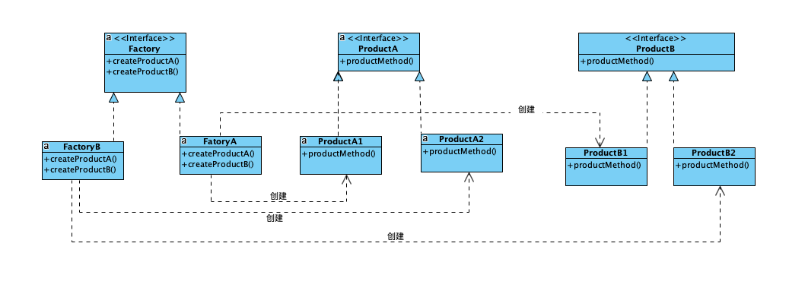

```
// productMethod 产品的方法
@protocol ProductA <NSObject>
-(void)productMethod;
@end
@protocol ProductB <NSObject>
-(void)productMethod;
@end
//工厂抽象方法
@protocol Factory <NSObject>
//创建产品A实例
+ (id<ProductA>)createProductA:(NSString *)ProductAName;
//创建产品B实例
+ (id<ProductB>)createProductB:(NSString *)ProductBName;
@end

//工厂类A 协议在.m中实现
@interface Factory1 : NSObject<Factory>
@end
//工厂类B 协议在.m中实现
@interface Factory2 : NSObject<Factory>
@end

//产品A 实现协议代替 抽象方法 协议在.m中实现
@interface ProductA1 : NSObject<ProductA>
@end
@interface ProductA2 : NSObject<ProductA>
@end
//产品B 实现协议代替 抽象方法 协议在.m中实现
@interface ProductB1 : NSObject<ProductB>
@end
@interface ProductB2 : NSObject<ProductB>
@end
```

使用起来很简单，首先创建工厂，然后根据工厂来产出想要的产品。
```
//A工厂生产产品
ProductA1 *a1 =[Factory1 createProductA:NSStringFromClass(ProductA1.class)];
ProductA1 *a2 =[Factory1 createProductA:NSStringFromClass(ProductA2.class)];
[a1 productMethod];
[a2 productMethod];

//B工厂生产产品B
//此处 省略代码
```

优点很明显只需要更改工厂就可以改变生产流水线，缺点是当需要进行新增一个产品，则需要对工厂的所有子类进行更改。
### 三个工厂模式联系
> 当抽象工厂模式中每一个具体工厂类只创建一个产品对象，也就是只存在一个产品等级结构时，抽象工厂模式退化成工厂方法模式；当工厂方法模式中抽象工厂与具体工厂合并，提供一个统一的工厂来创建产品对象，并将创建对象的工厂方法设计为静态方法时，工厂方法模式退化成简单工厂模式。

**简单工厂有一个静态方法生产一个产品，工厂模式是工厂方法抽象出来生产一个产品，抽象工厂是工厂抽象方法生产多个产品。**

####  4.建造者模式

建造者模式(Builder Pattern)：将一个复杂对象的构建与它的表示分离，使得同样的构建过程可以创建不同的表示。

建造者模式是一步一步创建一个复杂的对象，它允许用户只通过指定复杂对象的类型和内容就可以构建它们，用户不需要知道内部的具体构建细节。建造者模式属于对象创建型模式。根据中文翻译的不同，建造者模式又可以称为生成器模式。

建造者模式包含如下角色：

- Builder：抽象建造者
- ConcreteBuilder：具体建造者
- Director：指挥者
- Product：产品角色

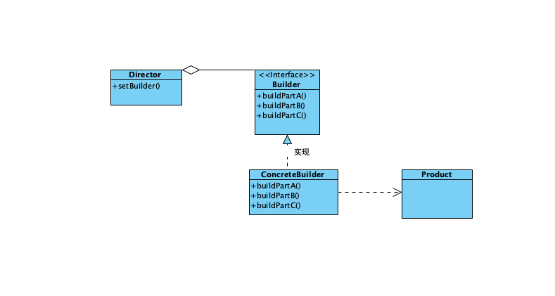

代码
```
@protocol Builder <NSObject>
@optional
- (void)buildPartA;
- (void)buildPartB;
- (void)buildPartC;
- (instancetype)getResult;
@end

@interface BuilderA : NSObject<Builder>
- (void)buildPartA;
@end
@interface BuilderB : NSObject<Builder>
- (void)buildPartB;
@end


@interface Builder : NSObject
- (id)constuct;//加工
- (void)setBuilder:(id<Builder>)bd;
@end

//实现
//.m
@implementation BuilderA

- (void)buildPartA{
	printf("build A");
}
-(instancetype)getResult
{
	return self;
}
@end
@implementation BuilderB

- (void)buildPartB{
	printf("build B");
}
-(instancetype)getResult
{
	return self;
}
@end


@interface Builder ()
{
	id<Builder> _bd;
}
@end
@implementation Builder
- (id)constuct{
	//加工几个步骤
	[_bd buildPartA];
	[_bd buildPartB];
	[_bd buildPartC];
	//组装得到产品
	return [_bd getResult];
}
- (void)setBuilder:(id<Builder>)bd{
	_bd = bd;
}
@end
```

优点是客户不知道具体的生产步骤，将生产步骤和过程解耦，可以相同的步骤(有子类实现不同过程)生产不同的产品，扩展方便，只需要(子类)实现每个步骤，缺点是多个产品相似点很多才能抽象出来步骤。


#### 5. 单例模式
单例模式(Singleton Pattern)：单例模式确保某一个类只有一个实例，而且自行实例化并向整个系统提供这个实例，这个类称为单例类，它提供全局访问的方法。

单例模式的要点有三个：一是某个类只能有一个实例；二是它必须自行创建这个实例；三是它必须自行向整个系统提供这个实例。单例模式是一种对象创建型模式。单例模式又名单件模式或单态模式。

单例模式包含如下角色：

- Singleton：单例

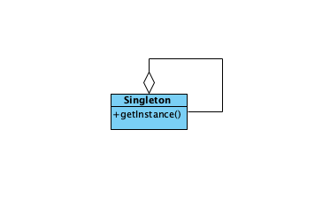

代码
```
@interface Singleton : NSObject
+ (instancetype)getInstace;
@end

@implementation Singleton
+ (instancetype)getInstace{
	static dispatch_once_t onceToken;
	static Singleton *_t;
	dispatch_once(&onceToken, ^{
		_t = [Singleton new];
	});
	return _t;
}
@end

```
使用起来也很简单
```
Singleton  *ton=[Singleton getInstace];
//next code
```
优点内存中该类的实例化只有一次，省略了频繁创建和销毁步骤，提高了性能。缺点是单例模式没有抽象层，扩展比较困难。

### 结构型模式

结构型模式(Structural Pattern)描述如何将类或者对 象结合在一起形成更大的结构，就像搭积木，可以通过 简单积木的组合形成复杂的、功能更为强大的结构。

结构型模式包含模式

- 适配器模式(Adapter)
- 桥接模式(Bridge)
- 装饰模式(Decorator)
- 外观模式(Facade)
- 享元模式(Flyweight)
- 代理模式(Proxy)

####  6.适配器模式
适配器模式(Adapter Pattern) ：将一个接口转换成客户希望的另一个接口，适配器模式使接口不兼容的那些类可以一起工作，其别名为包装器(Wrapper)。适配器模式既可以作为类结构型模式，也可以作为对象结构型模式。

适配器模式包含如下角色：

- Target：目标抽象类
- Adapter：适配器类
- Adaptee：适配者类
- Client：客户类


代码
```
@interface Adaptee : NSObject
- (void)specificRequest;
@end

@interface Adapter : NSObject
@property (nonatomic,strong) Adaptee *adaptee;

+ (instancetype)initWithAdaptee:(Adaptee *)obj;
- (void)request;
@end


@implementation Adaptee

- (void)specificRequest{
    NSLog(@"适配器 第三方工人干活了");
}

@end
@implementation Adapter

+ (instancetype)initWithAdaptee:(Adaptee *)obj{
    Adapter *adapter=[Adapter new];
    adapter.adaptee = obj;
    return adapter;
}
//通过适配器 指导三方工人干活，达到 客户忽略过程，多个客户可以复用适配器代码
- (void)request{
    [self.adaptee specificRequest];
}

@end
```
优点是经过加工第三方可以为客户服务了，缺点是不支持多继承的一次只能适配一个。

####  7.桥接模式
桥接模式(Bridge Pattern)：将抽象部分与它的实现部分分离，使它们都可以独立地变化。它是一种对象结构型模式，又称为柄体(Handle and Body)模式或接口(Interface)模式。

<!--使用协议或者抽象类对功能进行抽象化，桥接对需要桥接的对象抽象化，进行功能的组合达到目的，和构造者区别是构造者注重分步和结果，目标不拥有构造者，桥接注重拥有抽象类的实例，和调用实例的方法(不注重分步骤)，适配器注重步骤(没先后顺序)的执行才能对目标的使用，不注重顺序，注重组装思想。-->

桥接模式包含如下角色：

- Abstraction：抽象类
- RefinedAbstraction：扩充抽象类
- Implementor：实现类接口
- ConcreteImplementor：具体实现类


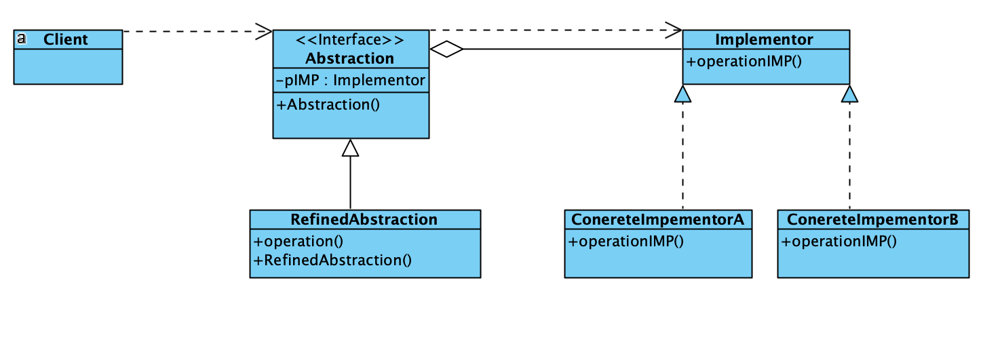

优点是抽象`Implementor`，具体实现在`Implementor`子类实现，降低耦合。缺点是桥接模式的引入会增加系统的理解与设计难度，由于聚合关联关系建立在抽象层，要求开发者针对抽象进行设计与编程。


####  8.装饰模式
装饰模式(Decorator Pattern) ：动态地给一个对象增加一些额外的职责(Responsibility)，就增加对象功能来说，装饰模式比生成子类实现更为灵活。其别名也可以称为包装器(Wrapper)，与适配器模式的别名相同，但它们适用于不同的场合。根据翻译的不同，装饰模式也有人称之为“油漆工模式”，它是一种对象结构型模式。
装饰模式包含如下角色：

- Component: 抽象构件
- ConcreteComponent: 具体构件
- Decorator: 抽象装饰类
- ConcreteDecorator: 具体装饰类

代码
```
//定义了协议
@protocol ComponentProtocol <NSObject>
- (void)opertion;
@end
//实现协议的类
@interface ComponentA : NSObject<ComponentProtocol>
@end
@interface ComponentB : NSObject<ComponentProtocol>
@end

//ComponentA的分类
@interface Component : ComponentA(add)
- (void)addMethod;
@end

//实现部分
//.m
@implementation ComponentA
- (void)opertion{
    NSLog(@"ComponentA opertion ");
}
@end

@implementation ComponentB
- (void)opertion{
    NSLog(@"ComponentB opertion ");
}
@end
//ComponentA的分类
@implementation Component(add)
- (void)addMethod{
    NSLog(@"addMethod");
}
@end
```
优点动态添加功能(iOS中的分类)，缺点是类变多(多个分类)时，排查错误不好排查。
####  9.外观模式

外观模式(Facade Pattern)：外部与一个子系统的通信必须通过一个统一的外观对象进行，为子系统中的一组接口提供一个一致的界面，外观模式定义了一个高层接口，这个接口使得这一子系统更加容易使用。外观模式又称为门面模式，它是一种对象结构型模式。

外观模式包含如下角色：

- Facade: 外观角色
- SubSystem:子系统角色


代码
```
//子系统角色
@interface SystemA : NSObject
- (void)run;
@end
//子系统角色
@interface SystemB : NSObject
- (void)eat;
@end
//子系统角色
@interface SystemC : NSObject
- (void)play;
@end
//外观角色
@interface Facade : NSObject
@property (nonatomic,strong) SystemA *a;
@property (nonatomic,strong) SystemB *b;
@property (nonatomic,strong) SystemC *c;
@end
```
优点降低用户和子系统的耦合，而且可以通过外观访问子系统，子系统可移植性强，缺点是外观没有进行抽象化，更改子系统必须更改外观类。

####  10.享元模式
享元模式(Flyweight Pattern)：运用共享技术有效地支持大量细粒度对象的复用。系统只使用少量的对象，而这些对象都很相似，状态变化很小，可以实现对象的多次复用。由于享元模式要求能够共享的对象必须是细粒度对象，因此它又称为轻量级模式，它是一种对象结构型模式。

享元模式包含如下角色：

- Flyweight: 抽象享元类
- ConcreteFlyweight: 具体享元类
- UnsharedConcreteFlyweight: 非共享具体享元类
- FlyweightFactory: 享元工厂类


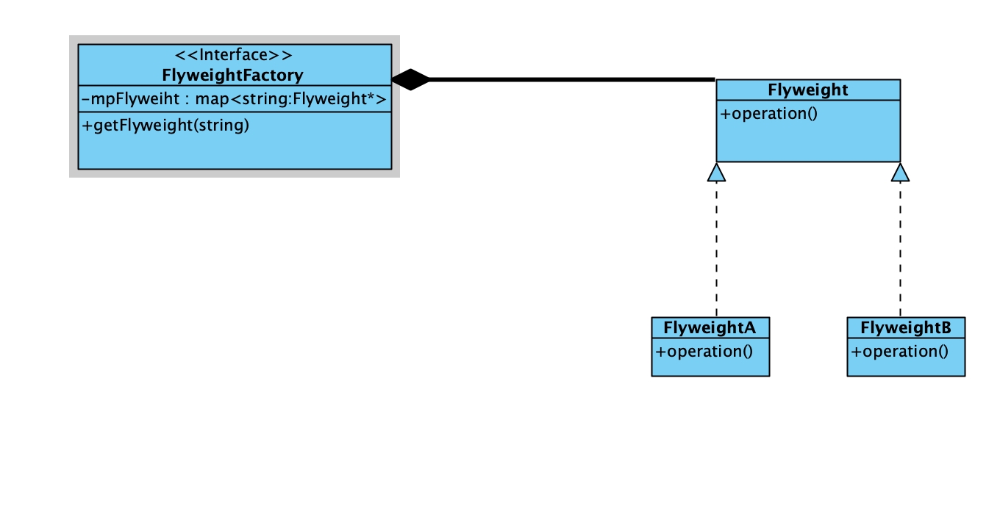
代码

```
@interface FYFly : NSObject
@property (nonatomic,strong) NSMutableDictionary  * dic;

@end

@protocol FlyweightProtocol <NSObject>

- (void)play;
@end

@interface FlyweightA : NSObject<FlyweightProtocol>
- (void)eat;
@end
@interface FlyweightB : NSObject<FlyweightProtocol>
- (void)run;
@end

@implementation FlyweightA

- (void)play{
	NSLog(@"我在玩耍");
}
- (void)eat{
	NSLog(@"我在吃饭");
}
@end

@implementation FlyweightB

- (void)play{
	NSLog(@"我在玩耍");
}
- (void)run{
	NSLog(@"我在跑步");
}
@end
```
优点多个重复使用率高的对象使用该模式，可以提高效率，缺点使系统更加复杂。


####  11.代理模式
代理模式比较简单，系统的`tableView`中就是使用代理实现的。

### 行为型模式

> 行为型模式(Behavioral Pattern)是对在不同的对象之间划分责任和算法的抽象化。
 行为型模式不仅仅关注类和对象的结构，而且重点关注它们之间的相互作用。
> 通过行为型模式，可以更加清晰地划分类与对象的职责，并研究系统在运行时实例对象 之间的交互。在系统运行时，对象并不是孤立的，它们可以通过相互通信与协作完成某些复杂功能，一个对象在运行时也将影响到其他对象的运行。

行为型模式分为类行为型模式和对象行为型模式两种：

- 类行为型模式：类的行为型模式使用继承关系在几个类之间分配行为，类行为型模式主要通过多态等方式来分配父类与子类的职责。

- 对象行为型模式：对象的行为型模式则使用对象的聚合关联关系来分配行为，对象行为型模式主要是通过对象关联等方式来分配两个或多个类的职责。根据“合成复用原则”，系统中要尽量使用关联关系来取代继承关系，因此大部分行为型设计模式都属于对象行为型设计模式。

包含模式
- 职责链模式(Chain of Responsibility)
- 命令模式(Command)
- 解释器模式(Interpreter)
- 迭代器模式(Iterator)
- 中介者模式(Mediator)
- 备忘录模式(Memento)
- 观察者模式(Observer)
- 状态模式(State)
- 策略模式(Strategy)
- 模板方法模式(Template Method)
- 访问者模式(Visitor)

下面我们挑选几种重要的演练一下

#### 12命令模式

命令模式(Command Pattern)：将一个请求封装为一个对象，从而使我们可用不同的请求对客户进行参数化；对请求排队或者记录请求日志，以及支持可撤销的操作。命令模式是一种对象行为型模式，其别名为动作(Action)模式或事务(Transaction)模式。

命令模式包含如下角色：

- Command: 抽象命令类
- ConcreteCommand: 具体命令类
- Invoker: 调用者
- Receiver: 接收者
- Client:客户类


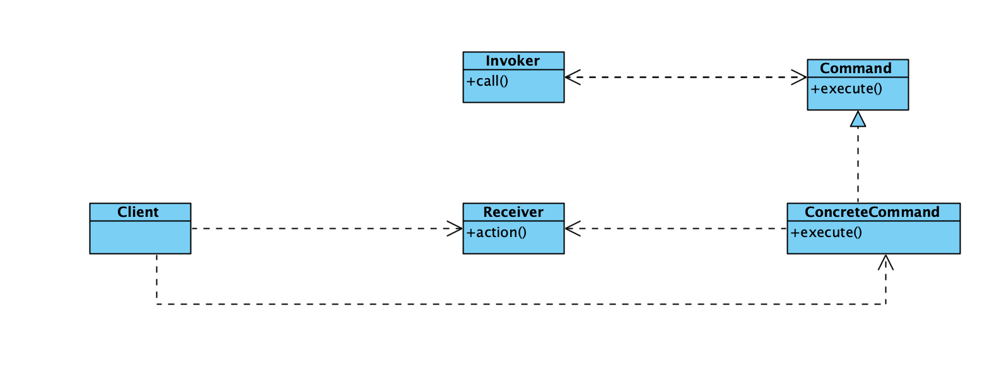

代码

```
@interface Order : NSObject
- (void)exe;
@end

@protocol CommandProtocol <NSObject>

- (void)play;

@end

@interface Order1 : NSObject<CommandProtocol>

@end
@interface Order2 : NSObject<CommandProtocol>

@end
@interface Order3 : NSObject<CommandProtocol>

@end


@implementation Order
- (void)exe{
	[[Order1 new] play];
}
@end
@implementation Order1

- (void)play {
	NSLog(@"进入公园");
	[[Order2 new] play];
}

@end
@implementation Order2

- (void)play {
	NSLog(@"开始打球");
	[[Order3 new] play];
}

@end
@implementation Order3
- (void)play{
	NSLog(@"开始打羽毛球");
}
@end

```

优点类之间耦合度低，缺点单一的命令会造成过多的实体类。

#### 13中介者模式
中介者模式(Mediator Pattern)定义：用一个中介对象来封装一系列的对象交互，中介者使各对象不需要显式地相互引用，从而使其耦合松散，而且可以独立地改变它们之间的交互。中介者模式又称为调停者模式，它是一种对象行为型模式。

中介者模式包含如下角色：

- Mediator: 抽象中介者
- ConcreteMediator: 具体中介者
- Colleague: 抽象同事类
- ConcreteColleague: 具体同事类


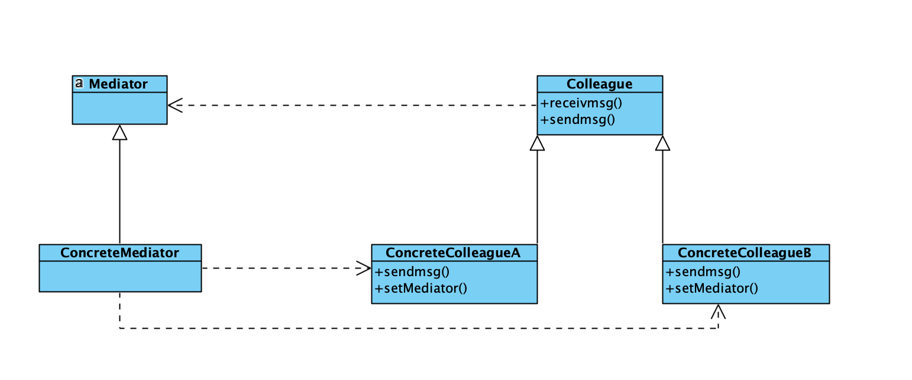
代码

```
@interface Meditor : NSObject

- (void)registerObj:(NSString *)key;

- (void)sendMsg:(NSString *)key msg:(NSString *)msg;
@end

@protocol ColleagueProtocol <NSObject>

- (void)sendmsg:(NSString *)msg;

@end

@interface ColleagueA : NSObject<ColleagueProtocol>

@end
@interface ColleagueB : NSObject<ColleagueProtocol>

@end


@interface Meditor(){
	NSMutableDictionary *_dic;
}
@end

@implementation Meditor
- (void)registerObj:(NSString *)key id:(id<ColleagueProtocol>)obj{
	if (_dic ==nil) {
		_dic=[NSMutableDictionary dictionary];
	}
	[_dic setObject:key forKey:obj];
}
- (void)sendMsg:(NSString *)key msg:(NSString *)msg{
	id <ColleagueProtocol> obj = _dic[key];
	[obj sendmsg:msg];
}
@end

@implementation ColleagueA

- (void)sendmsg:(NSString *)msg{
	NSLog(@"ColleagueA send %@",msg);
}

@end
@implementation ColleagueB

- (void)sendmsg:(NSString *)msg{
	NSLog(@"ColleagueB send %@",msg);
}

@end
```


优点简化对相互之间交互，降低耦合，缺点会导致终结者非常复杂。


#### 14观察者模式

观察者模式(Observer Pattern)：定义对象间的一种一对多依赖关系，使得每当一个对象状态发生改变时，其相关依赖对象皆得到通知并被自动更新。观察者模式又叫做发布-订阅（Publish/Subscribe）模式、模型-视图（Model/View）模式、源-监听器（Source/Listener）模式或从属者（Dependents）模式。

观察者模式是一种对象行为型模式。

观察者模式包含如下角色：

- Subject: 目标
- ConcreteSubject: 具体目标
- Observer: 观察者
- ConcreteObserver: 具体观察者


代码

```
@interface ViewController ()
@property (nonnull,nonatomic,assign) int age;
@end

@implementation ViewController

- (void)viewDidLoad {
	[super viewDidLoad];
	// Do any additional setup after loading the view.
	[self addObserver:self forKeyPath:@"age"
			  options:NSKeyValueObservingOptionNew|NSKeyValueObservingOptionOld
			  context:nil];
}
- (void)observeValueForKeyPath:(NSString *)keyPath ofObject:(id)object change:(NSDictionary<NSKeyValueChangeKey,id> *)change context:(void *)context{
	NSLog(@"%@",change);
}

@end
```

优点可以实时监测到对象的变化，缺点是订阅者过多会造成性能低下，观察者只知道变化的结果，不了解变化的是如何变化的。
#### 15状态模式
状态模式(State Pattern) ：允许一个对象在其内部状态改变时改变它的行为，对象看起来似乎修改了它的类。其别名为状态对象(Objects for States)，状态模式是一种对象行为型模式。

状态模式包含如下角色：

- Context: 环境类
- State: 抽象状态类
- ConcreteState: 具体状态类


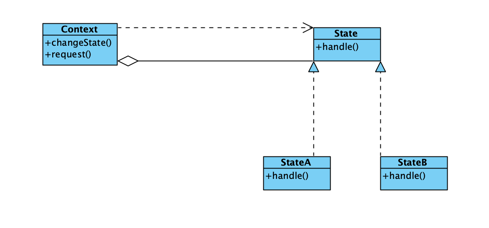
代码

```
typedef enum : NSUInteger {
	StateClose = 0,
	StateOpen = 1,
} State;
@interface StateClass : NSObject

@property (nonatomic,assign) State s;
@end
@implementation StateClass
- (void)setS:(State)s{
	switch (s) {
		case StateOpen:
		{
			NSLog(@"飞机已启动");
		}
			break;
		case StateClose:
		{
			NSLog(@"飞机已落地");
		}
			break;
			
		default:
			break;
	}
}
@end
```

优点是使用状态控制类的行为，缺点是新增状态需要修改状态类对应的源码。

#### 16策略模式

策略模式(Strategy Pattern)：定义一系列算法，将每一个算法封装起来，并让它们可以相互替换。策略模式让算法独立于使用它的客户而变化，也称为政策模式(Policy)。

策略模式包含如下角色：

- Context: 环境类
- Strategy: 抽象策略类
- ConcreteStrategy: 具体策略类


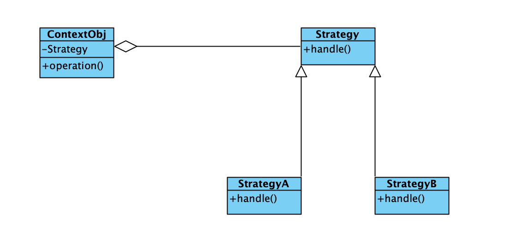
代码

```
@interface Strategy : NSObject
- (void)handle;
@end
@interface StrategyA : NSObject
- (void)handle;
@end
@interface StrategyB : NSObject
- (void)handle;
@end

@interface Context : NSObject
@property (nonatomic,strong) Strategy *obj;
- (void)opertion;
@end

@implementation Context
- (void)opertion{
	[self.obj handle];
}
@end
@implementation Strategy
- (void)handle{}
@end
@implementation StrategyA

- (void)handle{
	NSLog(@"老三 算数");
}

@end
@implementation StrategyB

- (void)handle{
	NSLog(@"老四 算数");
}

@end
```
优点可以灵活增加算法，缺点是客户必须知道策略的算法从而决定了解使用哪个算法，策略会产生多个对象，可以使用享元模式进行对象管理。


[代码包含类图和源文件下载](https://github.com/ifgyong/demo/tree/master/%E8%AE%BE%E8%AE%A1%E6%A8%A1%E5%BC%8F)
### 参考资料
- [设计模式](http://c.biancheng.net/)
- [设计模式](https://design-patterns.readthedocs.io/)
- java设计模式[清华出版社]
